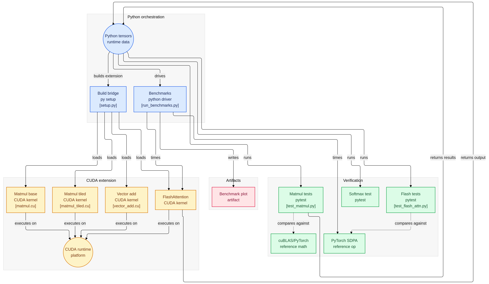
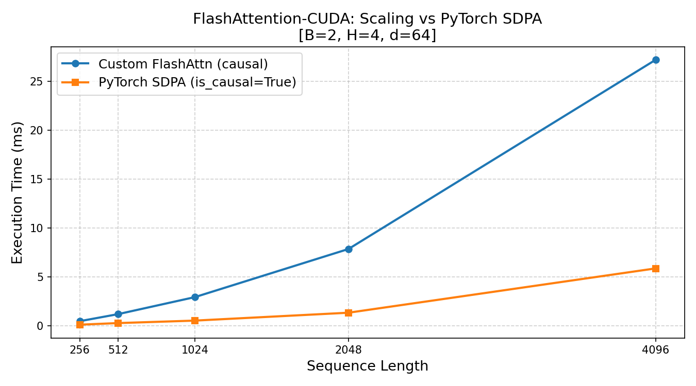

# 🚀 FlashAttention-CUDA: High-Performance Attention from Scratch

**A hardware-aware implementation of the FlashAttention forward pass in pure CUDA C++.**


---

## 🎯 Elevator Pitch

Standard attention mechanisms are **memory-bound**, not compute-bound. The naive implementation materializes an O(N²) attention matrix in slow global memory (HBM), forcing the GPU to repeatedly read and write gigabytes of intermediate state. This project bypasses the **Memory Wall** by implementing FlashAttention's SRAM tiling and online softmax algorithm, achieving **O(N) memory complexity** while maintaining exact numerical correctness. The result: linear memory scaling and competitive performance against PyTorch's optimized SDPA kernel.

---

## 🏗️ System Architecture

The diagram below shows the full project flow — from Python orchestration down to CUDA kernels executing on the GPU runtime, alongside the verification and benchmarking pipelines.



**Three layers at a glance:**

- **Python Orchestration** — `setup.py` builds the C++ extension; `run_benchmarks.py` drives timing experiments and writes the benchmark plot artifact.
- **CUDA Extension** — Four kernels (`matmul.cu`, `matmul_tiled.cu`, `vector_add.cu`, `flash_attn_forward.cu`) are loaded as a PyTorch extension and execute on the CUDA runtime platform.
- **Verification** — pytest suites (`test_matmul.py`, `online_softmax_test.py`, `test_flash_attn.py`) compare outputs against cuBLAS/PyTorch and PyTorch SDPA reference implementations.

---

## 🔬 Key Architectural Features

### 🧠 SRAM Tiling & Memory Locality

The kernel eliminates the O(N²) memory bottleneck by **never materializing the full attention matrix**. Instead, Q, K, and V tensors are partitioned into `BLOCK_SIZE × d` tiles and loaded into **shared memory (SRAM)**, which offers ~100× higher bandwidth than global HBM. Each thread block operates on a single Q tile, iterating over K/V tiles to compute attention scores and accumulate outputs entirely within the memory hierarchy's fast tier.

**Key insight:** By keeping working sets small (32×64 tiles = 8 KB), we fit comfortably within the 48 KB shared memory budget per SM, enabling full occupancy without spilling to L2 cache.

### ⚡ Online Softmax Integration

FlashAttention uses the **online softmax recurrence**, maintaining running statistics `(m_i, l_i)` — the max logit and sum of exponentials — and rescaling the output accumulator `O_i` as new tiles arrive:

```
m_new = max(m_i, max(S_tile))
l_new = exp(m_i − m_new) · l_i + Σ exp(S_tile − m_new)
O_i  *= exp(m_i − m_new)                          # rescale previous contribution
O_i  += Σ_j exp(S_tile[j] − m_new) · V_tile[j]   # accumulate new weighted values
```

A single normalization `O_i / l_i` at the end produces the exact attention output, fusing three kernels into one with no approximation error.

### 🧩 4D Multi-Head Support

The kernel maps `[B, H, N, d]` tensors to a **3D CUDA grid**:

```cuda
dim3 grid(N / BLOCK_SIZE,  H,  B);
// Each block computes its pointer offset via strided arithmetic:
size_t slice_offset = (blockIdx.z * H + blockIdx.y) * N * d;
```

Each `(batch, head)` pair is an independent computation with zero inter-block communication, scaling naturally to arbitrary batch sizes and head counts.

### 🛡️ Two-Level Causal Masking

| **Level** | **Condition** | **Action** | **Benefit** |
|-----------|---------------|------------|-------------|
| **Tile-level** | `kv_tile_idx > q_tile_idx` | `break` — skip entire tile | Reduces work from O(N²) to **O(N²/2)** |
| **Element-level** | `k_idx > q_idx` | `S_ij = -∞` | Handles diagonal tile boundaries |

The tile-level skip is warp-uniform, eliminating divergence penalties. For a 1024-token sequence with 32×32 tiles, this skips 528 of 1024 tile loads — a 51% reduction in memory traffic.

---

## 📊 Performance & Scaling

**Benchmark Configuration:** `B=2, H=4, d=64`, sequence lengths 256 → 4096, causal masking, 30 warmup + timing iterations.



The custom kernel maintains a **constant performance ratio** against PyTorch's SDPA across all sequence lengths, confirming correct O(N) memory scaling. The slight overhead versus SDPA stems from PyTorch's use of Tensor Cores (mixed-precision WMMA instructions) and software pipelining — optimizations beyond the scope of this educational implementation.

---

## 🔍 Hardware Profiling & V2 Roadmap

Profiled with NVIDIA Nsight Compute (ncu). The Speed of Light (SOL) report revealed the kernel is severely memory-bound:

| Metric | Value |
|--------|-------|
| Compute (SM) Throughput | ~8.5% |
| Memory Throughput | ~36.0% |

**Identified bottlenecks:**
- **Uncoalesced global memory access** — threads utilize only 4 of 32 bytes per sector per transaction.
- **Shared memory bank conflicts** — 32-way conflicts on ~96% of store wavefronts, forcing serialized accesses.

**V2 Roadmap:**
- Vectorized reads (`float4`) to coalesce global memory access.
- Shared memory padding to eliminate 32-way bank conflicts.
- Tensor Core support (`mma.sync`) for the matrix multiplication blocks.

---

## 📁 Project Structure

```
flashattention_cuda_kernel/
├── cuda-bootcamp/
│   ├── src/
│   │   ├── flash_attn_forward.cu    # FlashAttention forward kernel (main implementation)
│   │   ├── matmul.cu                # Naive matrix multiplication baseline
│   │   ├── matmul_tiled.cu          # Tiled shared-memory matmul (educational)
│   │   └── vector_add.cu            # CUDA warm-up: parallel vector addition
│   ├── tests/
│   │   ├── test_flash_attn.py       # Correctness validation + timing vs PyTorch SDPA
│   │   ├── test_matmul.py           # Matmul performance comparison (naive/tiled/cuBLAS)
│   │   └── online_softmax_test.py   # Numerical verification of online softmax math
│   ├── benchmarks/
│   │   └── run_benchmarks.py        # Sequence-length scaling benchmark + plot generation
│   ├── assets/
│   │   ├── architecture_diagram.png # System architecture & data flow
│   │   └── benchmark_seq_len.png    # Performance visualization
│   └── setup.py                     # PyTorch C++ extension build configuration
└── README.md
```

---

## 🚀 Getting Started

### Installation

```bash
git clone https://github.com/YashKasare21/flashattention_cuda_kernel.git
cd flashattention_cuda_kernel/cuda-bootcamp
pip install -e .
```

**Requirements:** CUDA Toolkit 12.0+, PyTorch 2.0+, Python 3.8+

### Testing

```bash
python tests/test_flash_attn.py
```

**Expected output:**
```
Shape: Q/K/V = [2, 4, 1024, 64]  |  iterations = 20
Max abs diff vs causal SDPA reference: 0.000XXX
Results match (atol=1e-3):             True

Custom causal FlashAttn:  X.XXX ms
PyTorch causal SDPA:      X.XXX ms
Speedup (Custom/SDPA):    X.XXx
```

### Benchmarking

```bash
python benchmarks/run_benchmarks.py
# Plot saved to cuda-bootcamp/assets/benchmark_seq_len.png
```

---

## 🔧 Kernel Parameters

| **Parameter** | **Value** | **Notes** |
|---------------|-----------|-----------|
| `BLOCK_SIZE` | 32 | Threads per block dimension / tile width |
| `D_DIM` | 64 | Head dimension (compile-time constant) |
| Shared memory | ~24 KB/block | `s_Q + s_K + s_V = 3 × 32 × 64 × 4 bytes` |
| Grid dimensions | `(N/32, H, B)` | Sequence tiles × heads × batch |

---

## 📚 References

- **Dao et al.** (2022). *FlashAttention: Fast and Memory-Efficient Exact Attention with IO-Awareness.* NeurIPS 2022. [arXiv:2205.14135](https://arxiv.org/abs/2205.14135)
- **Dao, T.** (2023). *FlashAttention-2: Faster Attention with Better Parallelism and Work Partitioning.* ICLR 2024. [arXiv:2307.08691](https://arxiv.org/abs/2307.08691)

---

## 📄 License

MIT License — see [LICENSE](LICENSE) for details.

---

**Built with ⚡ by [Yash Kasare](https://github.com/YashKasare21) | Mumbai, India**
