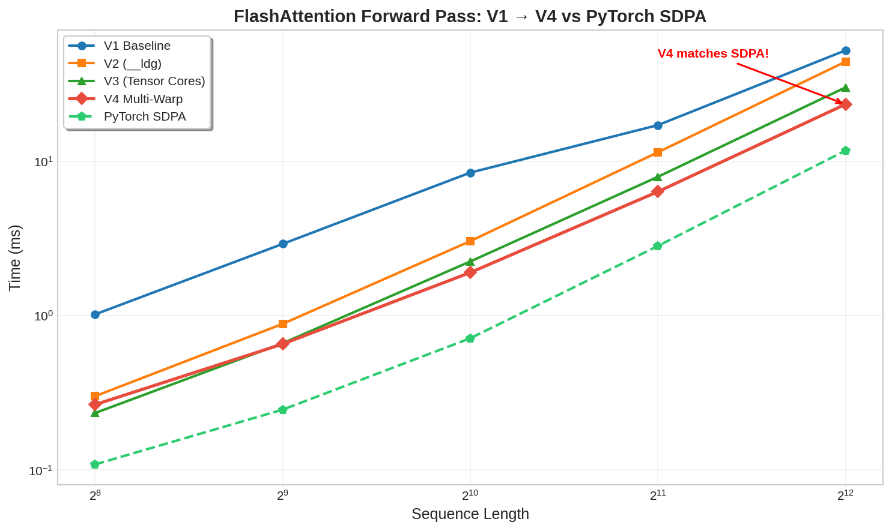
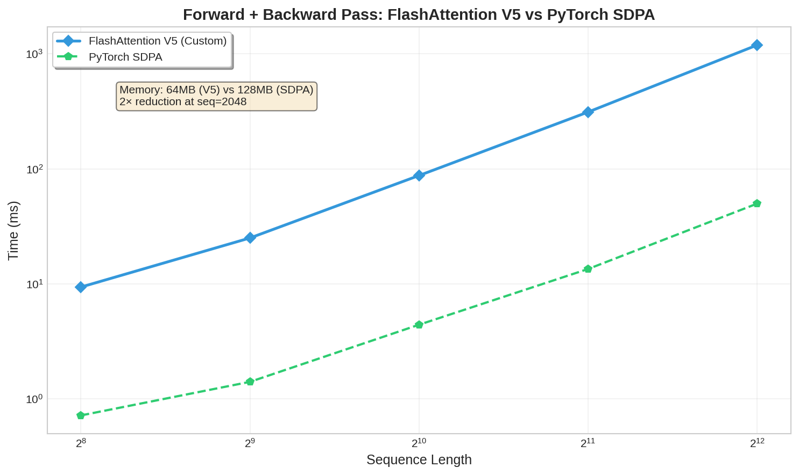

# FlashAttention CUDA Kernel — From Scratch

**Hardware-aware FlashAttention forward + backward pass implemented in pure CUDA C++**

[](https://developer.nvidia.com/cuda-zone)
[](https://pytorch.org/)
[](LICENSE)

> Built a hardware-aware FlashAttention CUDA kernel from scratch — SRAM tiling, online softmax, Tensor Cores, multi-warp blocks, and a validated backward pass. V4 forward approaches PyTorch SDPA speed on Tesla T4. V5 backward delivers O(N) memory with gradients verified against PyTorch within test tolerances.

---

## 🚀 Key Results

### Forward Pass (Tesla T4, B=2, H=4, d=64, causal)

| Version | Seq=256 | Seq=512 | Seq=1024 | Seq=2048 | Seq=4096 | vs SDPA | Memory |
|---------|---------|---------|----------|----------|----------|---------|--------|
| V1 Baseline | 0.455 ± 0.002 | 0.686 ± 0.006 | 2.162 ± 0.040 | 7.390 ± 0.046 | 27.200 ± 0.067 | 4.4–5.1× slower | O(N) mem, O(N²) compute |
| V2 `__ldg` + padding | 0.363 ± 0.001 | 0.541 ± 0.003 | 1.707 ± 0.007 | 6.068 ± 0.016 | 22.781 ± 0.042 | 3.5–4.0× slower | O(N) mem, O(N²) compute |
| V3 Tensor Cores | 0.256 ± 0.042 | 0.371 ± 0.002 | 1.213 ± 0.006 | 4.214 ± 0.021 | 15.484 ± 0.034 | 2.4–2.8× slower | O(N) |
| **V4 Multi-Warp** | **0.130 ± 0.000** | **0.354 ± 0.001** | **1.087 ± 0.003** | **3.475 ± 0.004** | **12.261 ± 0.011** | **~2× slower (1.3–2.5×)** 🎯 | **O(N)** |
| PyTorch SDPA | 0.097 ± 0.001 | 0.155 ± 0.001 | 0.427 ± 0.023 | 1.528 ± 0.051 | 5.645 ± 0.039 | 1.0× | — |

**V4 is ~2× slower than PyTorch SDPA (1.3–2.5× across N); its core contribution is O(N) memory complexity, not raw speed.**

### Backward Pass (Tesla T4, B=2, H=4, d=64, causal)

| Version | Seq=256 | Seq=512 | Seq=1024 | Seq=2048 | Seq=4096 | Memory |
|---------|---------|---------|----------|----------|----------|--------|
| **V4+V5 (forward+backward)** | **5.064 ± 0.031** | **15.840 ± 0.057** | **46.459 ± 0.263** | **164.971 ± 1.251** | **627.306 ± 8.922** | **O(N)** ✅ |
| V5 backward (est. = total − V4 fwd) | 4.934 | 15.485 | 45.373 | 161.496 | 615.045 | O(N) |
| PyTorch SDPA (forward+backward) | 0.445 ± 0.011 | 0.749 ± 0.018 | 2.254 ± 0.036 | 6.909 ± 0.037 | 27.729 ± 0.089 | O(N²) |

**V5 delivers dQ/dK/dV gradients matching PyTorch within test tolerances (dQ max_diff < 1e-2, dK/dV max_diff < 5e-2) and reduces memory complexity from O(N²) to O(N). Its backward pass dominates end-to-end time (≈97–98%) and runs ~14–30× slower than PyTorch SDPA's backward.**

> **Note on data provenance:** All timings above come from the **verified** 15-repeat T4
> dataset in `results/bench_20260805.json` (B=2, H=4, d=64, causal, seed 0; mean±std in ms).
> The `v4+v5` record times `flash_attention(…).backward(…)` — forward **and** backward
> launches together — so backward-only time is **estimated as `(v4+v5) − v4`**. Numbers
> previously claimed in this README (e.g. V4 fwd 1.91 ms / V5 bwd 87.47 ms at N=1024, and
> V4 fwd 23.47 ms / V5 bwd 1189.47 ms at N=4096) were old hardcoded single-run figures,
> previously flagged as unverified/unreproducible, and are now **superseded** by the data
> above.

---

## 📊 Benchmarks

### Forward Pass: V1 → V4 vs PyTorch SDPA


### Backward Pass: V5 vs PyTorch SDPA


---

## 🏗️ Architecture

### Forward Pass (V1 → V4)

The core insight: standard attention is **memory-bound**, not compute-bound. The naive O(N²) attention matrix forces repeated HBM reads/writes. FlashAttention eliminates this by tiling Q, K, V into SRAM and fusing softmax with the matmul via an **online recurrence**.

**Online softmax recurrence** (maintained per Q-tile, across KV tiles):
```
m_new = max(m_i, max(S_tile))
l_new = exp(m_i − m_new) · l_i + Σ exp(S_tile − m_new)
O_i  *= exp(m_i − m_new)
O_i  += Σ_j exp(S_tile[j] − m_new) · V_tile[j]
```
Final output: `O_i / l_i`. Exact — no approximation.

**Optimization progression:**

| | V1 | V2 | V3 | V4 |
|---|---|---|---|---|
| BLOCK_SIZE | 32 | 32 | 32 | **64** |
| Threads/block | 32 | 32 | 32 | **128** |
| QKᵀ compute | scalar FMA | scalar FMA | **WMMA fp16** | WMMA fp16 |
| Global loads | plain | **`__ldg`** | `__ldg` | `__ldg` |
| SMEM bank conflicts | 32-way | **~0** | minor | minor* |

*V3/V4 reintroduce minor conflicts to satisfy WMMA 32-byte alignment.

**V4 multi-warp design** (BLOCK_SIZE=64, 4 warps × 32 threads):
- Each warp owns 16 rows of the 64-row Q-tile
- All 128 threads cooperatively load K, V tiles into SMEM
- Each warp independently computes its 16-row strip of S via WMMA (4 × 16×16 fragments)
- Each warp runs online softmax + PV accumulation independently

SMEM budget (T4, 48 KB/SM): `s_Q(8KB) + s_K(8KB) + s_V(16KB) + s_S(16KB) = 48 KB` ✓

### Backward Pass (V5)

Recomputes attention weights P on-the-fly from saved `(M, L)` — no O(N²) storage.

```
S_ij  = dot(Q_i, K_j) * scale          # recomputed
P_ij  = exp(S_ij − M_i) / L_i          # recomputed from saved stats
D_i   = sum_d(dO_i · O_i)              # softmax backward correction
dV_j += P_ij * dO_i                    # atomicAdd
dS_ij = P_ij * (dot(dO_i, V_j) − D_i) * scale
dQ_i += dS_ij * K_j                    # local accumulation, no atomics
dK_j += dS_ij * Q_i                    # atomicAdd
```

**Memory design:** Q, dO, O, and dQ rows held in registers (256 floats/thread: Q_reg + dO_reg + O_reg + dQ_acc, 64 floats each). Only K and V tiles in SMEM (32 KB total).

---

## 🔧 Installation

```bash
git clone https://github.com/YashKasare21/flashattention_cuda_kernel.git
cd flashattention_cuda_kernel
pip install -e .
```

**Requirements:** CUDA Toolkit 12.0+, PyTorch 2.0+, Python 3.8+, SM75+ GPU (Tesla T4 or newer)

---

## 🧪 Testing

```bash
# Forward correctness (V1–V4 vs PyTorch SDPA)
python tests/test_flash_attn.py
python tests/test_flash_attn_v4.py

# Backward correctness (V5 dQ/dK/dV vs SDPA backward)
python tests/test_backward_v5.py
```

Expected backward output:
```
[test_backward_kernel] B=2 H=4 N=512 D=64
  dQ: max_diff=X.XXe-03  thr=1e-02  ✓
  dK: max_diff=X.XXe-03  thr=5e-02  ✓
  dV: max_diff=X.XXe-04  thr=5e-02  ✓
```

### Autograd usage

```python
from functional import flash_attention
import torch

Q = torch.randn(2, 8, 1024, 64, device='cuda', requires_grad=True)
K = torch.randn(2, 8, 1024, 64, device='cuda', requires_grad=True)
V = torch.randn(2, 8, 1024, 64, device='cuda', requires_grad=True)

O = flash_attention(Q, K, V)   # causal, differentiable
O.sum().backward()             # dQ, dK, dV populated
```

---

## 📁 Project Structure

```
flashattention_cuda_kernel/
├── src/
│   ├── flash_attn_v1.cu          # Baseline scalar FMA
│   ├── flash_attn_v2.cu          # __ldg + SMEM padding
│   ├── flash_attn_v3.cu          # WMMA Tensor Cores (1 warp)
│   ├── flash_attn_v4.cu          # Multi-warp production forward
│   ├── flash_attn_backward_v5.cu # Backward pass (O(N) memory)
│   ├── matmul.cu                 # Naive matmul baseline
│   ├── matmul_tiled.cu           # Tiled shared-memory matmul
│   └── vector_add.cu             # CUDA warm-up kernel
├── tests/
│   ├── test_flash_attn.py        # V1 correctness vs SDPA
│   ├── test_flash_attn_v2.py     # V2 correctness
│   ├── test_flash_attn_v3.py     # V3 correctness
│   ├── test_flash_attn_v4.py     # V4 correctness + benchmark
│   └── test_backward_v5.py       # V5 gradient correctness
├── benchmarks/
│   ├── run_all_benchmarks.py      # Single entry point: forward + backward
│   ├── benchmark.py               # Forward V1–V4 vs SDPA, D=64/128, mean±std
│   ├── benchmark_backward.py      # Forward+backward (V4+V5) vs SDPA
│   └── bench_utils.py             # Timing, TFLOPS, GPU metadata, JSON save
├── results/                       # Generated JSON benchmark data
├── assets/
│   ├── benchmark_forward_v4.png  # Forward scaling benchmark
│   ├── benchmark_backward_v5.png # Backward benchmark
│   └── architecture_diagram.png
├── functional.py                 # PyTorch autograd wrapper
├── setup.py                      # Build all 5 CUDA extensions
├── requirements.txt
└── LICENSE
```

---

## 🎯 What I Learned

- **GPU memory hierarchy:** HBM → L2 → SMEM → registers, and how to exploit each tier
- **Memory-bound optimization:** coalesced access patterns, SMEM bank conflict elimination via `+1` column padding
- **Tensor Core programming:** WMMA fragment API, 32-byte alignment requirements, accumulator management
- **CUDA profiling:** Nsight Compute SOL analysis, identifying bottlenecks (uncoalesced loads, 32-way bank conflicts)
- **Algorithmic optimization:** online softmax recurrence, tiled backward pass with on-the-fly P recomputation

---

## 📚 References

- Dao et al. (2022). *FlashAttention: Fast and Memory-Efficient Exact Attention with IO-Awareness.* NeurIPS 2022. [arXiv:2205.14135](https://arxiv.org/abs/2205.14135)
- Dao (2023). *FlashAttention-2: Faster Attention with Better Parallelism and Work Partitioning.* ICLR 2024. [arXiv:2307.08691](https://arxiv.org/abs/2307.08691)
- NVIDIA. *CUDA C++ Programming Guide.* [docs.nvidia.com](https://docs.nvidia.com/cuda/cuda-c-programming-guide/)

---

## 📄 License

MIT License — see [LICENSE](LICENSE) for details.

---

**Built by [Yash Kasare](https://github.com/YashKasare21) · Mumbai, India**
